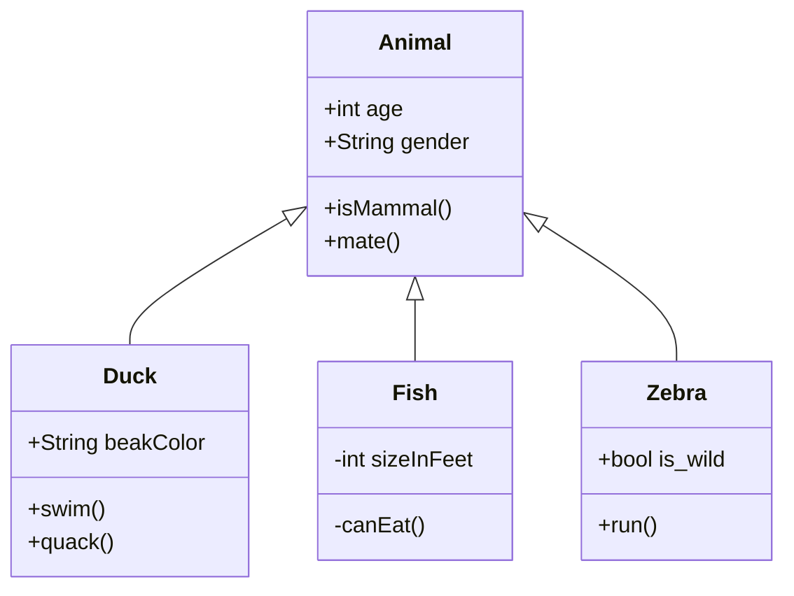

# OOP

## Conceptos 
### Clase
Una clase es una abstracción de un objeto, son los planos para la construcción de estos. Contiene información de las características (atributos) y comportamiento (métodos)

Un ejemplo de esto en la vida real es la clase persona. Una persona tiene muchas características y también tiene comportamiento que es común a todas las personas. 


### Objeto

Los objetos son una instancia de las clases. Es la clase hecha realidad, hecha "materia".

Yo soy una instancia de la clase persona, yo tengo un cuerpo, tengo cabeza, tengo miembros, un cerebro, entre otras cosas.

Yo puedo pensar, puedo ver, caminar, comer, entre otros.


### Interfaz

Una interfaz es un contrato de uso de una clase. En ésta se define cómo se interactúa con objetos de esa clase.

#### Ejemplos de interfaz en la vida real
* El manubrio de un carro, su acelerador, los cambios. Todos estos funcionan de una manera estándar sin importar el modelo del carro.
* El teclado de los computadores
* Los enchufes de energía son una interfaz entre el sistema eléctrico y los dispositivos electrónicos. Todos los enchufes en una región particular cumplen con ciertas características que garantizan el correcto acople entre el equipo eléctrico y el sistema eléctrico, no importa donde se enchufe o qué electrodoméstico se enchufe, hay un correcto acople porque se cumple con ese contrato.


## Herencia

Recibo todas las características de la clase madre, incluyendo atributos y métodos




[mermaid live editor](https://mermaid-js.github.io/mermaid-live-editor/#/edit/eyJjb2RlIjoiZ3JhcGggVERcbiAgQVtDaHJpc3RtYXNdIC0tPnxHZXQgbW9uZXl8IEIoR28gc2hvcHBpbmcpXG4gIEIgLS0-IEN7TGV0IG1lIHRoaW5rfVxuICBDIC0tPnxPbmV8IERbTGFwdG9wXVxuICBDIC0tPnxUd298IEVbaVBob25lXVxuICBDIC0tPnxUaHJlZXwgRltmYTpmYS1jYXIgQ2FyXVxuXHRcdCIsIm1lcm1haWQiOnsidGhlbWUiOiJkZWZhdWx0In19)

* clase Persona
	* clase Niño
	* clase Adulto


## Abstracción

La abstracción consiste en ocultar los detalles de la implementación 

el uso de interfaces para abstraer el comportamiento de las clases.
Una interfaz es un contrato de uso de una clase. En ésta se define cómo se interactúa con esa clase, sin importar cómo se haga la implementación de esta.

En la vida real una interfaz es una abstracción de la 

Aunque los tanto los vehículos eléctricos como los de gasolina andan, cada uno tiene una implementación distinta de la generación de energía necesaria para conducir. Nuestra interfaz con el vehículo es el manubrio, palanca y acelerador, por medio de estos `conducimos` el carro, mas los procesos físicos internos de un carro eléctrico y un carro mecánico son completamente distintos, y aún así, ambos nos sirven para `conducir`. 

```kotlin
interface ICoduncible(){
	fun conducir()
	
}

class Carro:IConducible(){
	val manubrio
	....
	overide fun conducir(){
		////
	}
}


```


## Polimorfismo
Consiste en poder 'reformar' parte del comportamiento 

El uso de 'overide' con las funciones de métodos heredados por una clase madre o incluso de una interfaz es un ejemplo de esto.

```kotlin
interface ISaltarin{
	fun saltar(){
		println("Animal salta")
	}
}

class Rabbit:ISaltarin{
	overide fun saltar(){
		println("Conejo salta")
	}
}
```

Un ejemplo real podría ser cómo aunque todos 'Pensamos', todos lo hacemos de una manera distinta. O como aunque un caballo, un perro o una persona son capaces de correr, cada uno lo hace de manera distinta.

## Encapsulamiento

El encapsulamiento consiste en ocultar la información o datos a agentes que no necesitan esa información. El encapsulamiento nos sirve mucho para evitar "efectos secundarios" 

### Internal
Con internal limito el uso de un atributo a aquella clase donde el objeto fue inicializado.

Ejemplo:
* Un fabricante puede cambiar el empaque de un producto si lo requiere, o volverlo a pintar de otro color.
* Un carro que puede usar todos los que viven dentro de una casa.


### Public
Son datos o métodos que pueden obtener y en casos modificar libremente cualquier otra clase.

Ejemplo:
* La información que está disponible en una página web para ser leída
* El bus de transporte público que puede usar cualquier persona.


### Private
Solo puede acceder a los métodos o atributos dentro de la clase. 

Ejemplo:
* Un vehículo que solo puede conducir su dueño
* Un documento que solo puede leer aquel que tiene acceso.

### Protected
Solo aquellos miembros de una clase o subclases tienen acceso a la información. La unica diferencia con private es que añade acceso a las subclases.

Ejemplos:
* El acto de 'hablar', este es un método protegido para las personas, porque niños, adultos y en general todo tipo de personas y derivados pueden hablar. Un Animal en cambio no tiene acceso a esa función.
* La aplicación de WhatsApp, dentro de esta tenemos nuestros mensajes y estos solo se pueden acceder por medio de la misma aplicación de WhatsApp en el móvil y a traves de la aplicación de WhatsApp Desktop.

# Principios Generales
## DRY – Don't Repeat Yourself
En lo posible debemos tratar de no repetir funcionalidad. En general es algo que se puede aplicar desde el principio a la hora de hacer código.

Dentro de mi código el mejor ejemplo de DRY es cómo creé una HashTable para guardar los valores de las líneas de mi factura, evitando así tener que crear repetitivamente arreglos para guardar cada dato y tener que hacer operaciones sobre estos. También, el uso de loops como el for each a la hora de imprimir la factura es un ejemplo de esto. 

## KISS – Keep It Simple and Stupid

Aunque se pueden intentar generar muchas abstracciones para el código, primero se debe hacer un código funcional y sencillo. Los principios SOLID solo deberían ser aplicados cuando de verdad sea necesario y no siempre son la mejor opción.

Por ejemplo se podría usar el principio de "Single responsibility" para separar el código a un nivel atómico, sin embargo hay que saber ponerle un límite a esto.

# SOLID
## Single responsibility

Cada clase debe tener una responsabilidad única y clara. 

Un ejemplo de **violación** de este principio es una clase llamada de forma ambigua, por ejemplo la clase Factura. Al momento de hacer una factura hay muchas funciones implicadas, como Imprimir, añadir líneas, añadir clientes, etc. Poner todo esto dentro de la clase Factura es una violación al principio. 


## Open - Closed
La clase debe ser extendible sin la necesidad de modificarla.

El polimorfismo y el encapsulamiento nos ayudan con esto.


Ejemplo: 
```kotlin
abstract class Persona{
	abstract fun actividad()
}

class Buzo:Persona{
	overide fun actividad(){
		return fun bucear()
	}
}

class Programador:Persona{
	overide fun actividad{
		return fun programar()
	}
}

class Bailarin:Persona{
	overide fun actividad{
		return fun bailar()
	}
}

class Estudiante{
	fun hacerActividad(estudiante:Persona){
		estudiante.actividad()
	}
}

fun main{ 
	var estudiante = Estudiante()
	estudiante.hacerActividad(Buzo())
	estudiante.hacerActividad(Programador())
}
```
Como se puede ver, estudiante puede hacer muchas nuevas actividades nuevas, sin necesidad ser modificado.


## Liskov Substitution Principle
Las instancias-objetos de clases hijas deben ser capaces de tener exactamente el mismo comportamiento de las instancias de las clases madre. 


## Interface segregation

Las interfaces y los métodos abstractos propuestos en estas deben ser acordes a lo que necesitan implementar las clases.


**Violación**: Una clase se ve obligada a usar un método que no va a usar a la hora de implementar una interfaz. Por ejemplo interfaces IFish y IRabbit con los métodos swim


```kotlin
interface IFish{
	fun swim()
}
interface IRabbit{
	fun jump()
	fun run()
}
class Fish:IFish
class Rabbit:IRabbit
class Frog:IFish,IRabbit  // Violacion del principio
```

Alternativa:
```kotlin
interface ISwimAble{
	fun swim()
}
interface IJumpAble{
	fun jump()
}
interface IRunAble{
	fun run()
}
class Fish:ISwimAble
class Rabbit:IJumpAble,IRunAble 
class Frog:IJumpAble,ISwimAble  // No se ve obligado a implementar métodos que no necesita
```


## Dependency Inversion Principle


Dentro de los parámetros de una de las funciones de una clase, si uso una instancia de otra clase (objeto) como argumento, se genera una dependencia hacia ese objeto y corro el riesgo de que si la implementación se hace de manera distinta, mi programa deje de funcionar.

Esto conceptualmente con un ejemplo de la vida real es como si yo organizara una conexión de energía a un electrodoméstico con cables pegados directamente a un generador eólico. Un problema que surge es la variabilidad del voltaje. Esto se soluciona usando la red eléctrica como interfaz.

Esto se explica mejor en el ejemplo del código de facturación con la clase Impresora que usa Cliente

``` kotlin
override fun imprimirRecibo(cliente: Cliente()) {  
    println("${cliente.Name} \n${cliente.Address}\n")
```

Hay varios problemas como: los permisos que puedan tener los atributos Name y Address, así como los valores de estos que podrían ser nulos o nisiquiera existir.

Cumpliendo el principio de inversión de dependencia:
```kotlin
interface ICliente{
	fun getName():String
	fun getAddress():String
}

class Impresora{}
	fun imprimirRecibo(cliente: ICliente) {  
	    println("${cliente.getName()} \n${cliente.getAddress()}\n")
		
```
Ahora puedo estar seguro de que requiero estos métodos dentro de las clases que implementen ICliente (como `Cliente()`) y que no me va a devolver valores nulos.

No solo eso, puedo lidiar con esos casos dentro de la implementación de forma más explícita. Todo esto ayuda semánticamente, porque se hace obvio a la hora de la implementación:

```kotlin
class cliente:ICliente{
	override fun getName(): String {  
    return nombre ?: "El cliente no tiene razon social"  
	}  
	override fun getAddress(): String {  
	    return direccion ?: "NA"  
	}
}
```


# Programación funcional
Dentro de mi código tengo una sección que hace una operación de impresión con cada elemento de la lista de keys

```kotlin
var subtotal = 0.0
for (item in cuadroFactura.getEntradas().keys){
	val cantidad =  cuadroFactura.getEntradas()[item]!!.first  
	val precio = cuadroFactura.getEntradas()[item]!!.second
	val precioLinea = cantidad * precio
	subtotal += precioLinea
}
```

Imperativo:
```kotlin
// Usando reduce
val subtotal2 = cuadroFactura.getEntradas().values.reduce{  
    sum, pair -> Pair(1, sum.second*sum.first+ pair.second*pair.first)  
}.second  
```
```kotlin
// Usando fold, tiene un valor inicial
val subtotal3 = cuadroFactura.getEntradas().values.fold(0.0){  
        sum, pair -> sum + pair.second*pair.first  
}
```


